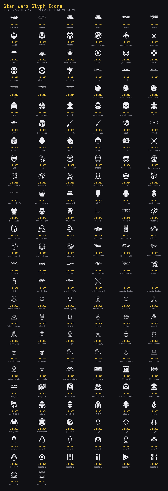

# Star Wars Glyph Icons

`JetBrainsMono Nerd Font` patched with 158 Star Wars glyphs (from [maxgreb/StarWars-Glyph-Icons](https://github.com/maxgreb/StarWars-Glyph-Icons)), remapped into free Supplementary PUA at **U+F1B00–U+F1B9D** so the font's existing FontAwesome range is untouched.

Built by [`starwars-jetbrains-mono.nix`](./starwars-jetbrains-mono.nix).



## Usage

Print any glyph by codepoint (zsh/bash):

```sh
echo $'\U000F1B21'   # darthvader
```

The `Glyph` column below renders only in editors/terminals using the patched font.

## All glyphs

| Codepoint | Name | Glyph |
| --- | --- | --- |
| `U+F1B00` | `starwars` | 󱬀 |
| `U+F1B01` | `sw-alt` | 󱬁 |
| `U+F1B02` | `sw-alt-2` | 󱬂 |
| `U+F1B03` | `title4` | 󱬃 |
| `U+F1B04` | `title5` | 󱬄 |
| `U+F1B05` | `title6` | 󱬅 |
| `U+F1B06` | `reball` | 󱬆 |
| `U+F1B07` | `newrep` | 󱬇 |
| `U+F1B08` | `galemp` | 󱬈 |
| `U+F1B09` | `mandalorcrest` | 󱬉 |
| `U+F1B0A` | `mandalorian` | 󱬊 |
| `U+F1B0B` | `blacksun` | 󱬋 |
| `U+F1B0C` | `sith` | 󱬌 |
| `U+F1B0D` | `galsenate` | 󱬍 |
| `U+F1B0E` | `newjediorder` | 󱬎 |
| `U+F1B0F` | `separ` | 󱬏 |
| `U+F1B10` | `jediorder` | 󱬐 |
| `U+F1B11` | `galrep` | 󱬑 |
| `U+F1B12` | `sithemp` | 󱬒 |
| `U+F1B13` | `kirkanos` | 󱬓 |
| `U+F1B14` | `credits` | 󱬔 |
| `U+F1B15` | `ep1` | 󱬕 |
| `U+F1B16` | `ep2` | 󱬖 |
| `U+F1B17` | `ep3` | 󱬗 |
| `U+F1B18` | `ep4` | 󱬘 |
| `U+F1B19` | `ep5` | 󱬙 |
| `U+F1B1A` | `ep6` | 󱬚 |
| `U+F1B1B` | `deathstar` | 󱬛 |
| `U+F1B1C` | `deathstar-3` | 󱬜 |
| `U+F1B1D` | `deathstar-4` | 󱬝 |
| `U+F1B1E` | `r2d2` | 󱬞 |
| `U+F1B1F` | `darthvader-3` | 󱬟 |
| `U+F1B20` | `yoda-2` | 󱬠 |
| `U+F1B21` | `darthvader` | 󱬡 |
| `U+F1B22` | `stormtrooper` | 󱬢 |
| `U+F1B23` | `c3po` | 󱬣 |
| `U+F1B24` | `yoda` | 󱬤 |
| `U+F1B25` | `bobbafett` | 󱬥 |
| `U+F1B26` | `saberjedi` | 󱬦 |
| `U+F1B27` | `sabersith` | 󱬧 |
| `U+F1B28` | `atat` | 󱬨 |
| `U+F1B29` | `xwing` | 󱬩 |
| `U+F1B2A` | `wookie` | 󱬪 |
| `U+F1B2B` | `akbar` | 󱬫 |
| `U+F1B2C` | `falcon` | 󱬬 |
| `U+F1B2D` | `leia` | 󱬭 |
| `U+F1B2E` | `tie` | 󱬮 |
| `U+F1B2F` | `lightsabers` | 󱬯 |
| `U+F1B30` | `kylo` | 󱬰 |
| `U+F1B31` | `bb8` | 󱬱 |
| `U+F1B32` | `trooper-ep7` | 󱬲 |
| `U+F1B33` | `phasma` | 󱬳 |
| `U+F1B34` | `trooper-o` | 󱬴 |
| `U+F1B35` | `darthvader-o` | 󱬵 |
| `U+F1B36` | `deathstar-o` | 󱬶 |
| `U+F1B37` | `falcon-o` | 󱬷 |
| `U+F1B38` | `r2d2-o` | 󱬸 |
| `U+F1B39` | `tfdroid-o` | 󱬹 |
| `U+F1B3A` | `c3po-o` | 󱬺 |
| `U+F1B3B` | `bobbafett-o` | 󱬻 |
| `U+F1B3C` | `rogueone-title` | 󱬼 |
| `U+F1B3D` | `rogueone-sybm` | 󱬽 |
| `U+F1B3E` | `rogueone-2` | 󱬾 |
| `U+F1B3F` | `k2s0` | 󱬿 |
| `U+F1B40` | `jynerso` | 󱭀 |
| `U+F1B41` | `cassianandor` | 󱭁 |
| `U+F1B42` | `mazkanata` | 󱭂 |
| `U+F1B43` | `deathtrooper` | 󱭃 |
| `U+F1B44` | `sawgerrera` | 󱭄 |
| `U+F1B45` | `tie-2` | 󱭅 |
| `U+F1B46` | `xwing-2` | 󱭆 |
| `U+F1B47` | `falcon-2` | 󱭇 |
| `U+F1B48` | `bobbafett-2` | 󱭈 |
| `U+F1B49` | `darthvader-2` | 󱭉 |
| `U+F1B4A` | `bb8-2` | 󱭊 |
| `U+F1B4B` | `cantina` | 󱭋 |
| `U+F1B4C` | `carbonite` | 󱭌 |
| `U+F1B4D` | `hologram` | 󱭍 |
| `U+F1B4E` | `deathstar-2` | 󱭎 |
| `U+F1B4F` | `combatdrone` | 󱭏 |
| `U+F1B50` | `falcon-3` | 󱭐 |
| `U+F1B51` | `landspeeder` | 󱭑 |
| `U+F1B52` | `speederbike` | 󱭒 |
| `U+F1B53` | `stardestroyer` | 󱭓 |
| `U+F1B54` | `xwing-3` | 󱭔 |
| `U+F1B55` | `tie-3` | 󱭕 |
| `U+F1B56` | `ywing` | 󱭖 |
| `U+F1B57` | `jedistarfight` | 󱭗 |
| `U+F1B58` | `sandcrawler` | 󱭘 |
| `U+F1B59` | `atat-2` | 󱭙 |
| `U+F1B5A` | `atst` | 󱭚 |
| `U+F1B5B` | `hanblaster` | 󱭛 |
| `U+F1B5C` | `blasterrifle` | 󱭜 |
| `U+F1B5D` | `lightsabers-2` | 󱭝 |
| `U+F1B5E` | `lukelightsaber` | 󱭞 |
| `U+F1B5F` | `kylolightsaber` | 󱭟 |
| `U+F1B60` | `darthvader-4` | 󱭠 |
| `U+F1B61` | `anakin` | 󱭡 |
| `U+F1B62` | `anakin-young` | 󱭢 |
| `U+F1B63` | `anakin-kid` | 󱭣 |
| `U+F1B64` | `hansolo` | 󱭤 |
| `U+F1B65` | `leia-2` | 󱭥 |
| `U+F1B66` | `lukeskywalker` | 󱭦 |
| `U+F1B67` | `c3po-2` | 󱭧 |
| `U+F1B68` | `r2d2-2` | 󱭨 |
| `U+F1B69` | `bb8-3` | 󱭩 |
| `U+F1B6A` | `padme` | 󱭪 |
| `U+F1B6B` | `yoda-3` | 󱭫 |
| `U+F1B6C` | `chewbacca` | 󱭬 |
| `U+F1B6D` | `emperor` | 󱭭 |
| `U+F1B6E` | `dooku` | 󱭮 |
| `U+F1B6F` | `darthmaul` | 󱭯 |
| `U+F1B70` | `stormtrooper-2` | 󱭰 |
| `U+F1B71` | `snowtrooper` | 󱭱 |
| `U+F1B72` | `clonetrooper` | 󱭲 |
| `U+F1B73` | `bobafett` | 󱭳 |
| `U+F1B74` | `jabba` | 󱭴 |
| `U+F1B74` | `jabba` | 󱭴 |
| `U+F1B75` | `imperialguard` | 󱭵 |
| `U+F1B76` | `quigonjinn` | 󱭶 |
| `U+F1B77` | `obiwankenobi` | 󱭷 |
| `U+F1B78` | `macewindu` | 󱭸 |
| `U+F1B79` | `starwarsrebels` | 󱭹 |
| `U+F1B7A` | `clonewars` | 󱭺 |
| `U+F1B7B` | `swtrilogy` | 󱭻 |
| `U+F1B7C` | `100clones` | 󱭼 |
| `U+F1B7D` | `lastjedi` | 󱭽 |
| `U+F1B7E` | `lastjedi-2` | 󱭾 |
| `U+F1B7F` | `40starwars` | 󱭿 |
| `U+F1B80` | `darthvader-5` | 󱮀 |
| `U+F1B81` | `stormtrooper-3` | 󱮁 |
| `U+F1B82` | `clonetrooper-2` | 󱮂 |
| `U+F1B83` | `bobafett-2` | 󱮃 |
| `U+F1B84` | `kylo-2` | 󱮄 |
| `U+F1B85` | `wookie-2` | 󱮅 |
| `U+F1B86` | `r2d2-3` | 󱮆 |
| `U+F1B87` | `c3po-3` | 󱮇 |
| `U+F1B88` | `bb8-4` | 󱮈 |
| `U+F1B89` | `xwingpilot` | 󱮉 |
| `U+F1B8A` | `firstorder` | 󱮊 |
| `U+F1B8B` | `phoenix` | 󱮋 |
| `U+F1B8C` | `porg-1` | 󱮌 |
| `U+F1B8D` | `porg-2` | 󱮍 |
| `U+F1B8E` | `porg-3` | 󱮎 |
| `U+F1B8F` | `porg-4` | 󱮏 |
| `U+F1B90` | `porg-5` | 󱮐 |
| `U+F1B91` | `porg-6` | 󱮑 |
| `U+F1B92` | `porg-7` | 󱮒 |
| `U+F1B93` | `porg-8` | 󱮓 |
| `U+F1B94` | `porg-9` | 󱮔 |
| `U+F1B95` | `porg-10` | 󱮕 |
| `U+F1B96` | `decals-1` | 󱮖 |
| `U+F1B97` | `decals-2` | 󱮗 |
| `U+F1B98` | `decals-3` | 󱮘 |
| `U+F1B99` | `decals-4` | 󱮙 |
| `U+F1B9A` | `decals-5` | 󱮚 |
| `U+F1B9B` | `holocron-1` | 󱮛 |
| `U+F1B9C` | `holocron-2` | 󱮜 |
